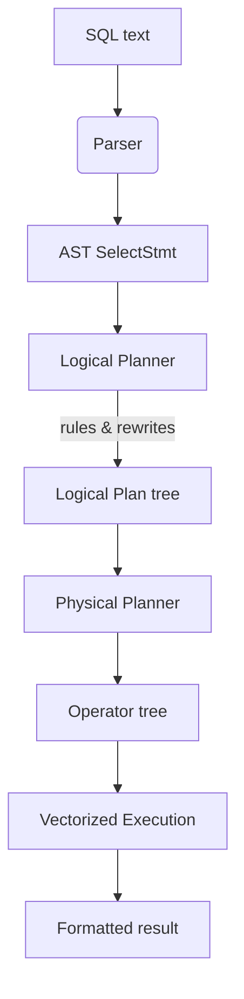
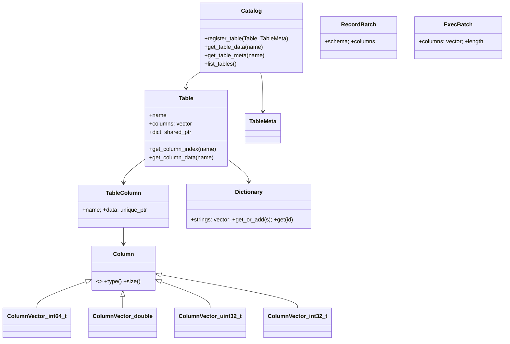

# bo-sql Architecture Guide

## Intent & Scope
bo-sql is a read-optimized, in-memory SQL engine designed to illustrate the full journey from SQL text to vectorized execution. The codebase favors clear layering over feature breadth so new contributors can reason about changes quickly. This guide walks through the major subsystems—parser, logical planning, physical execution—and the shared data structures that tie them together.

## End-to-End Pipeline

At runtime the CLI performs the following steps:
1. Load CSV tables into columnar storage via `storage::load_csv` and register them with the `Catalog`.
2. Parse interactive commands (`SELECT`, `EXPLAIN`, `LOAD`, etc.) in the REPL.
3. For `SELECT`, call `parse_sql`, build a logical plan, derive the physical operator tree, and stream batches through `run_query`.

## Core Data Model
The code base leans on a columnar representation with light-weight type metadata.

Key pieces:
- **Type system (`types.h`)**: `TypeId` enumerates supported types. `Datum` wraps literal values when expression evaluation is introduced. Template helpers (`type_id_for<T>`) keep ColumnVectors type-safe.
- **Column storage (`ColumnVector<T>`)**: Column-major arrays loaded directly from CSV. Data is immutable after load to simplify execution.
- **RecordBatch**: In-memory batch with schema metadata. Logical and physical layers can reuse it for operators that materialize intermediate results.
- **Table & Dictionary**: Each table owns its columns and a shared dictionary for string encoding. Column stats (min/max, NDV) live in `TableMeta` for future planner heuristics.
- **Catalog**: Central registry that provides data (for execution) and metadata (for planning, EXPLAIN, DESCRIBE).

## Parser & AST
`parser/parser.cpp` implements a handwritten recursive-descent parser tuned to the supported grammar.

Highlights:
- **Tokenization**: Converts SQL text into `Token` objects, distinguishing keywords, identifiers, numeric literals, and operators. Strings are handled with simple single-quote delimiters.
- **Expressions (`Expr`)**: Nodes cover column references, literals, binary operators, and simple function calls (`SUM`, `COUNT`, `AVG`). Each node can `clone()` itself—essential for the planner when duplicating expressions across plan nodes.
- **Select statement (`SelectStmt`)**: Captures SELECT list, FROM table, INNER JOIN chain, optional WHERE/GROUP BY/HAVING/ORDER BY/LIMIT. The AST intentionally stores expressions as owning `unique_ptr` to guarantee unique ownership.
- **Stringification**: `ast_to_string` provides `to_string()` helpers, used by EXPLAIN output and debugging.

Future parser extensions usually involve:
1. Adding new keywords to `TokenType` and the tokenizer.
2. Expanding expression parsing functions (e.g., `parse_factor`) while maintaining precedence rules.
3. Extending the AST structs to carry additional metadata (aliases, distinct flags, etc.).

## Logical Planning & Optimizer Intent
`LogicalPlanner::build_logical_plan` maps the AST to a tree of logical operators defined in `logical/logical.h`.

Logical operators:
- **LogicalScan**: Base table access with a provisional column projection.
- **LogicalFilter**: WHERE predicate wrapper (currently a direct clone of the AST expression).
- **LogicalProject**: SELECT list projection and alias tracking.
- **LogicalHashJoin**: INNER JOIN representation; records left/right key columns and optional residual predicates.
- **LogicalAggregate**: Encodes GROUP BY keys plus aggregate functions, along with desired aliases.
- **LogicalOrder** / **LogicalLimit**: ORDER BY and LIMIT semantics.

Planning workflow:
1. **Column discovery**: `collect_all_columns` traverses expressions to extract referenced column names; this seeds projection pruning for simple queries.
2. **Base relation assembly**: Builds either a single `LogicalScan` or a simple two-way `LogicalHashJoin`. Multi-join support is planned but not yet implemented.
3. **Predicate placement**: WHERE becomes a `LogicalFilter` pushed directly above the base relation. Future rewrite rules can push predicates past joins or aggregates.
4. **Aggregation and projection**: GROUP BY is converted into `LogicalAggregate`, then wrapped in a `LogicalProject` to match the SELECT list. Even without GROUP BY, a project node normalizes output aliases.
5. **Ordering & limiting**: ORDER BY and LIMIT wrap the upstream plan.

`get_output_schema` inspects the logical plan to infer output column names and types, using `Catalog` metadata when possible. Fallbacks default to `INT64` to keep the engine running until full type inference is wired in.

### Optimizer Roadmap
The architecture anticipates rule-based rewrites:
- Predicate pushdown into scans and join inputs.
- Projection pruning based on downstream column usage.
- Join order exploration using table statistics (`TableMeta::row_count`, `ColumnMeta::stats`).
Contributors can implement rewrites by introducing small transformation passes or pattern-specific helper functions around the logical plan tree.

## Physical Planning & Execution
`exec/physical_planner.cpp` lowers logical operators into runtime `Operator` objects defined in `exec/operator.hpp`.

### Execution Primitives
- **Operator interface**: Classic Volcano-style lifecycle (`open` → repeated `next` → `close`). Each `next` call produces an `ExecBatch` of up to 4096 rows.
- **ExecBatch & ColumnSlice**: Type-tagged, pointer-only views over column segments. Operators can forward slices without copying, or supply cleanup callbacks when they materialize new buffers.
- **ColumnarScan**: Streams batches straight from `Table` column vectors.
- **Selection**: Demonstrates vectorized filtering. The MVP implementation hard-codes a simple predicate to validate the API surface; real predicate evaluation hooks into parsed expressions.
- **Project**: Reorders or chooses specific columns, typically following a scan or filter.
- **Limit**: Truncates the stream once enough rows were produced.
- **run_query**: Drives the operator tree, accumulates results, and prints them in Markdown. Dictionary decoding happens here so execution can stay entirely numeric.

### Current Coverage & Gaps
The physical planner supports `SCAN`, `FILTER`, `PROJECT`, and `LIMIT`. Logical joins, aggregations, and ordering exist on paper but still need matching physical operators (`HashJoin`, `HashAggregate`, `OrderBy`) and expression evaluation. Adding them involves:
1. Implementing the corresponding `Operator` subclasses (e.g., hash table build/probe for joins).
2. Extending `build_physical_plan` to recognize the logical node and wire child operators.
3. Teaching `run_query` how to render the new output shapes (mostly already handled by column slices).

## CLI Integration
`cli/main.cpp` stitches everything together:
- Manages the REPL loop and command parsing (LOAD, SHOW, DESCRIBE, EXPLAIN, SELECT).
- Delegates CSV ingestion to `storage::load_csv`, which infers column types, calculates stats, and dictionary-encodes strings.
- For EXPLAIN, prints the logical plan tree using `LogicalOp::to_string` methods.
- For SELECT, executes the full pipeline described above and prints a table.

The CLI is intentionally lightweight, keeping engine concerns within dedicated modules. This makes it easy to embed the engine elsewhere or replace the front-end while reusing parsing and execution layers.

## Extensibility Guidelines
- **Add new SQL features incrementally**: update the parser, extend logical operators, then create matching physical operators. Ensure `get_output_schema` understands the new outputs.
- **Preserve batch semantics**: Any new operator should respect the `ExecBatch` vectorized contract to keep performance predictable.
- **Leverage metadata**: Catalog statistics are ready for optimizer improvements; avoid hard-coding assumptions in the planner when the catalog can provide real data.
- **Testing**: Use Catch2 to build focused tests per layer—parser round-trips, plan shape validation, operator behavior on synthetic batches.

By keeping layers decoupled yet explicit about their contracts, bo-sql offers a practical playground for experimenting with database engine ideas without the baggage of full SQL compliance.
